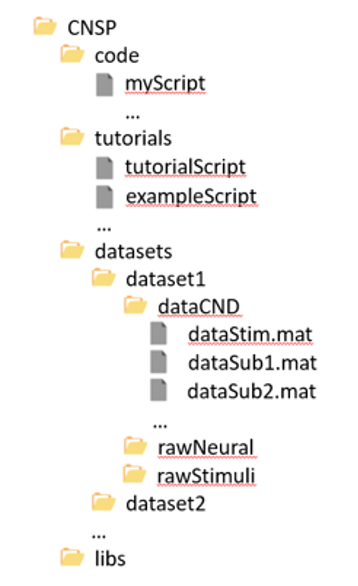
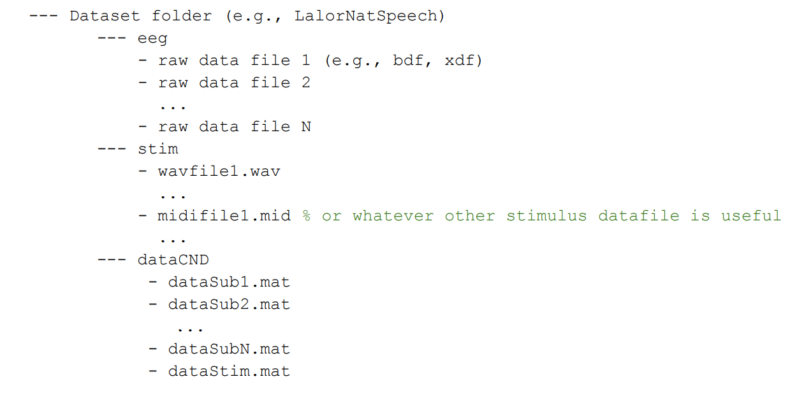

CNSP CND data structure
#######################

The CND structure (Continuous-event Neural Data) is a domain specific  data format defined to encourage standardisation, replicability, and reusability of the code. 
The CND format will make your life easier during the CNSP workshop. Here are three reasons to adopt the CND data structure:

#. By converting your data to CND, you will be able to run the CNSP-Workshop analysis scripts without changes. While this will be very useful when using CNSP resources, it is also an opportunity to make your future code reusable across projects;
#. This will facilitate the comparison of a particular analysis procedure on different datasets (e.g., envelope TRFs from the music and speech datasets just by changing one line of code) and, vice versa, to compare different analysis pipelines on the same dataset;
#. Standardisation will facilitate collaboration between research teams and, in the context of the CNSP-Workshop, it will allow us to answer your questions more rapidly and effectively.

How to save your dataset in CND 
===============================

A set folder structure is provided for containing all the experimental files, and is organised into ‘code’, ‘tutorials’, ‘datasets’, and ‘libs’ (libraries) folders (Fig 1).  
For simplicity, we advise users to have one main folder for each study. Within the dataset folder there is a ‘dataCND’ folder, containing as many ‘dataStimX.mat’ 
(stimulus files) and ‘dataSubX.mat’ (neural data) files as the number of participants. If all subjects were exposed to  the same identical stimuli, then a single ‘dataStim.mat’ file can be used (Fig 2). 

Key steps for storing according to the CND structure
====================================================
1) Create a project folder on your hard-drive (e.g., $ROOT/studentProject1/).
2) Copy the content of the CNSP GitHub folder into your new project folder. As a result, you will have three folders in there: datasets, exampleScripts, and libs. Indeed, datasets might contain only one dataset, if your project only has one dataset/experiment. 
3) Add a subfolder 'code', where you can add the analysis code specific to your project (while the tutorial folder is handy as it contains useful code that you can use in your project)
4) Add a subfolder for your dataset(s) (e.g., $ROOT/studentProject1/datasets/dataExperiment1/) with three subfolders. One for the raw neural data (e.g., 'rawEEG'). One for the raw audio stimuli (e.g., 'rawSoundStimuli'). One for the CND dataset ('CND').
5) Convert your raw data to CND, saving the dataStim and dataSub into the 'CND' subfolder.
6) You are good to go! You can now run the tutorial code or the GUI to process your CND data.

Example conversion script (BIDS->CND and BDF->CND)
======================================
Conversion from BIDS to CND is relatively straightforward, but it is experiment dependent. As BIDS does not include guidelines for storing preprocessed stimulus feature, some adjustments are required. We provide an example of this conversion in the Python script :download:`here <files/bids2cnd_example.py>`, which converts to CND the `MEG-MASC dataset <https://www.nature.com/articles/s41597-023-02752-5>`_.

We also provide an example Matlab script that was used for converting the `EEG Natural speech dataset <https://datadryad.org/stash/dataset/doi:10.5061/dryad.070jc>`_ from the BioSemi format BDS to CND :download:`here <files/bdf2CND_example2023.m>`. 

