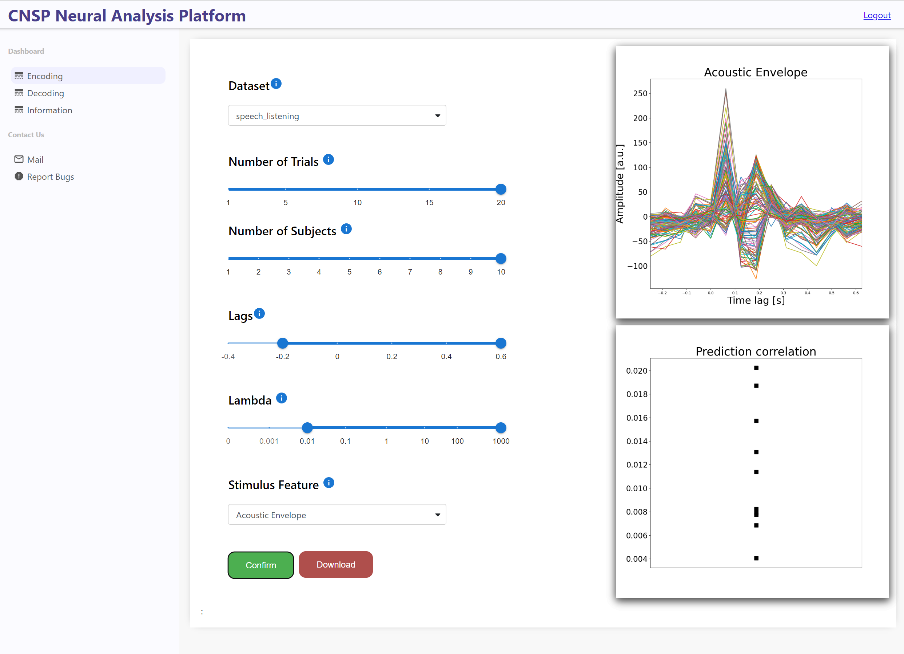

CNSP Web Based Data Browser
###########################

The CNSP web based data browser (0.0.1) is available `here <https://web-browser-408115.ew.r.appspot.com/home>`_.
Note that the current implementation is considered as a proof-of-concept, as resources are currently limited.

Introduction
================
This is first web-based data browser for continuous sensory neurophysiology. It does not require the installation of Matlab, or a Matlab license file. While the functionalities will be 
similar to those of the MATLAB-based GUI, the current version focuses on forward and backward TRF models only, with a limited number of variable options available. This prototype
web-application stores datasets and runs analyses directly on the cloud, meaning that the user is no longer limited to the computational constraints of their own machine. 

The web browser uses functions from the mTRF-Toolbox for Python REF. 

Logging in 
============
The web browser is password protected, please contact xx for the access password.
When logging in, a box will appear asking for the password. Enter it and select the 'Login' button. If the password was entered correctly, 'Success' will be written under the button, and the 
website will navigate to the '/home' webpage. If it does not navigate automatically please refresh the page.

Forward Model 
================
To run a forward TRF (encoding) navigate to the '/home' page. Choose the parameters to run (number of trials, number of subjects, lag values), the lambda values for cross validation, and the 
stimulus feature for graphing. 

Then press the 'Confirm' button. An estimate of how long the process will take will be written, please be patient and do not refresh the page while it is loading. Once the images are loaded 
you can download them.

Backward Model 
================
To run a backward TRF (decoding) navigate to the '/decoding' page using the sidebar. Choose the parameters to run (number of trials, number of subjects, lag values), the lambda values for cross validation, and the 
stimulus feature for graphing. Please bear in mind that backwards models take much longer than forward models when choosing the number of trials, subjects, and lambda values.

Then press the 'Confirm' button. An estimate of how long the process will take will be written, please be patient and do not refresh the page while it is loading. Once the images are loaded 
you can download them.

Download the data
==================
To download the images generated on the web browser, simply right click the images and select 'save as...', choosing a suitable file type. 
There is also an option to download the TRF that was generated. To do this click the 'Download TRF data button' at the bottom of the screen.  This will download a JSON file containing
information on the parameters chosen, as well as the times and TRF weights for each subject.
