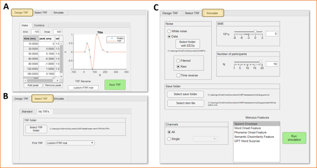

CNSP Data simulation toolkit
############################

One challenge of running TRFs on real EEG data is that the ground-truth neural signal buried behind
the EEG noise is unknown. As such, the TRF evaluation metrics are based on noisy data.
However, for the development of methodologies for neural signal analysis, and for the
generation of numerical expectations on a hypothesis, it is important to know that ground-truth signal. 
Simulation data is one possible approach to carry out such investigations while having access and control
over the ground-truth signal.

Here, we provide a simulation toolkit consisting of a small set of Matlab functions and of a graphical interface.
The simulation toolbox is in the `CNSP-Resources GitHub repository <https://github.com/CNSP-Workshop/CNSP-resources>`_.
The three steps needed for running simulations, as depicted in the figure below:
(1) Design TRF, (2) Select TRF, (3) Simulate neural signal.

