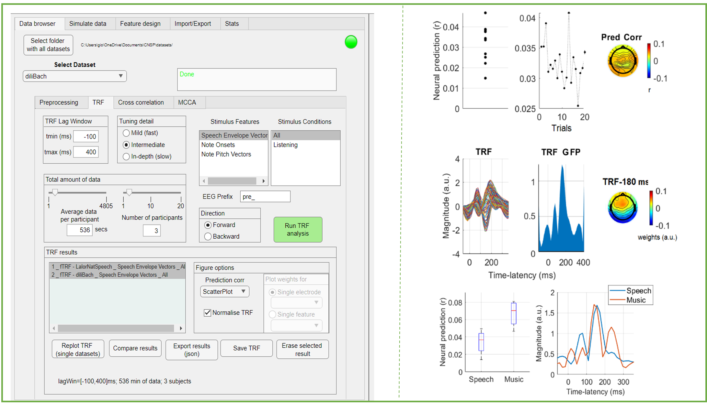

CNSP Data Browser GUI 
#####################

Introduction
================
This is a graphical user interface (GUI) which aims to simplify the process of analysis, where preprocessing and analytic choices are 
clearly presented to the user. The GUI requires installation of Matlab, but does not require a Matlab licence.
and can be found in the `CNSP-Resources GitHub repository <https://github.com/CNSP-Workshop/CNSP-resources>`_.

The aim is to make it easier and faster to re-analyse existing datasets, guiding the user through the process. This will be particularly 
relevant for those getting familiar with the CNSP resources for the first time.

Installation Guide 
===================
The executable file can be found at xx. When downloaded, a installation wizard will guide you through the setup process. Please make sure
to install the files as directed by the wizard, in an easily locatable folder. 
