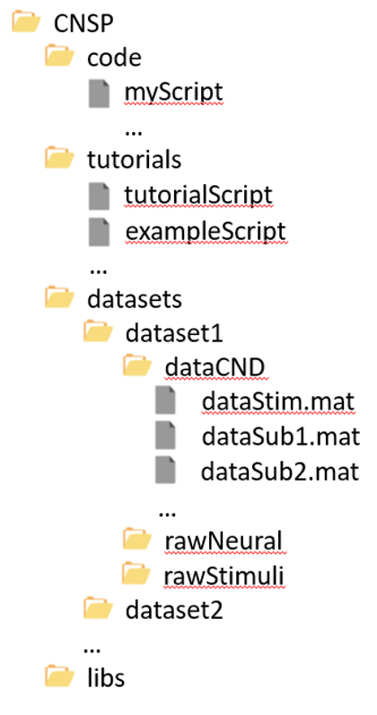
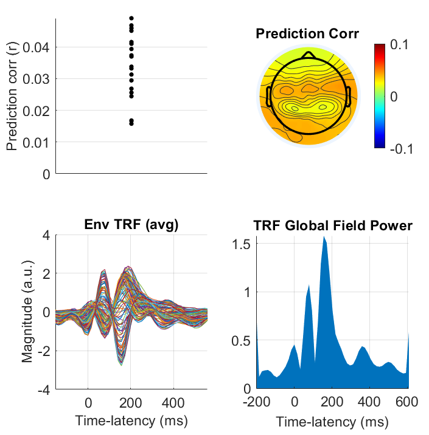
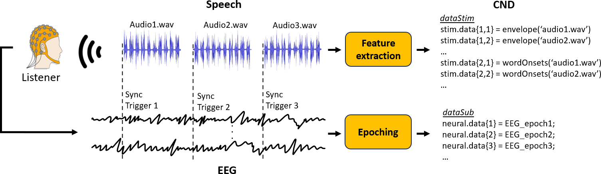

How-to Guides 
#############

This page contains a number of practical guides for setting up and using the CNSP resources.

This guide details the requirements and key steps for setting up the the CNSP resources on your computer.
The core component of the libraries and tutorials requires MATLAB software. We also include Python tutorials
and aim to add more in the future. Part of the resources are independent on a specific programming language (e.g., GUI).

Getting started - MATLAB
************************
This section will guide you through the process of setting up the CNSP core resources using MATLAB software.
You should have the MATLAB environment already installed on your computer (>2019, with the Signal Processing Toolbox).

Folder structure
================
First, let's set set up the CNSP starting package. This includes: a) the project folder structure;
b) the up-to-date libraries; and c) example scripts. We can't stress enough the importance of utilising the folder structure
and the file naming convention as indicated below. Inconsistencies will require unwanted changes to the scripts.

  
The up-to-date starter-kit is available `here <https://github.com/CNSP-Workshop/CNSP-resources/tree/main/CNSP>`_.
Please download the entire folder ('CNSP'). We suggest adding a folder names 'code', or 'code_projectName' if 
multiple projects will be carried out with these resources.
Please note that the libraries contain slim versions of dependencies such as EEGLAB
(used for the spline interpolation and topopolot functions),
the mTRF-Toolbox (used for the TRF method), and NoiseTools (used for the CCA method). Each folder contains the specific licence
and references for the corresponding library. The folder 'datasets' should only contains the datasets and, potentially,
their conversion scripts (e.g., bdf2cnd.m, bdf2bids).

Adding a dataset
================
Let's test if your workspace is ready to be used. To do so, you will need to add a dataset to your folder structure. If this
is the first time you do this, we suggest downloading the
`Natural Speech CND Dataset <https://www.data.cnspworkshop.net/data/datasetCND_LalorNatSpeech.zip>`_. This dataset was collected
by Edmund Lalor, Giovanni Di Liberto, and Michael Broderick, and it was utilised for a number of publications.
The dataset includes EEG data from N=19 individuals, who were presented with continuous speech from an audio-book
(see `<datasetsPage>`_ for further information). The CND dataset should be added to the dataset folder, as indicated in the figure above
i.e., `datasets/nauralSpeech/dataCND`.

Running an example script
=========================
You are now ready to test the first CNSP example script. Open `CNSP/exampleScrips/CNSP_example1_forwardTRF.m`.

This script is grouped in four parts:

#. Clearing workspace and adding path to dependencies
#. Preprocessing and analysis parameters
#. Preprocessing
#. Forward TRF analysis

Step 1, 2, and 4 will have to be run every time you use this script.
Insead, Step 3 (preprocessing) saves the preprocessing files, so it will only have to be run once
(or every time you want to change the preprocessing).

As a result you should obtain the figure below:

  
If this is what you see, then you can use the CNSP resources now. Otherwise, please see the next section on troubleshooting.

Troubleshooting
===============

The guidelines above include code and the dataset for running `CNSP_example1_forwardTRF.m`. So, what could go wrong?

Typical issues include:
 
#. MATLAB doesn't give an error, but *nothing happens*: You may have copied the dataset into the wrong folder.
   Or you might have downloaded some other dataset. Note that the dataset name should be specified in 
   `CNSP/exampleScrips/CNSP_example1_forwardTRF.m`
   by modifying the following line (around line 38):
   
   .. code-block:: javascript
	 
	 dataMainFolder = '../datasets/LalorNatSpeech/';
   
   
#. MATLAB returns an *error*: Since all key dependencies are in the `lib` folder, there might be issues with the version of MATLAB.

Setting up your dataset
***********************
This section will guide you through the process of setting up a new dataset so that it can be analysed
with the CNSP resources using MATLAB scripts or a `GUI <guiPage.html>`_ that can be used without MATLAB.

The experiment
==============
If you are designing a new neurophysiology experiment involving continuous stimuli, we have a few suggestions that
would make your experiment compatible with the CNSP scripts. The figure that follows depicts a typical audio-book
listening paradigm. Neural signals are recorded as participants listen to an audio-story grouped into chapters. 
Participants can take breaks between chapters. A synchronisation trigger is sent to the acquisition machine to mark
the sample (in the EEG stream) corresponding to the start of an audio chapter.

CND data storage
================
CND is a data format that plugs in directly onto the CNSP analysis scripts, GUI, and simulation toolkit,
as well as being compatible with toolboxes such as NapLib and EelBrain. Import/output functions are provided for
the effortless transition between CND and BIDS, in case you intend to carry out additional analyses with other
tools or to compare results between different algorithms.

How can you store your data in CND? If your experiment is similar to the one described in the previous section 
and you can save or export your raw data in .bdf (e.g., BioSemi Active 2), you might be able to run our conversion
script `bdf2cnd_example.m` by simply indicating the number of audiofiles and conditions in the experiment, as well
as the details of the acquisition device (e.g., number of channels, sampling frequency, external channels).

.. code-block:: javascript

	% EEG setup (please adjust to your experiment)
	fsEEG = 512;             % Recording frequency (Hz)
	eegChannelsIdxs = 1:64;  % idx of EEG scalp channels
	eegMastoidIdx = [65,66]; % idx of mastoid channels
	eegOtherExt = 67:72;     % idx of other external channels

	% Preprocessing parameters (please adjust to your experiment)
	subs = 1:10;                  % Subjects to process

	% Preprocessing parameters (Example experiment)
	trigCode_audioStart = 1:42; % all trigger codes corresponding to the
								% start of a trial
	nAudioFiles = 42;           % number of audio files
	nCond = 1;                  % number of conditions, where conditions have the same audio-material
								% (e.g., listening vs. imagery;
								%        audio-visual vs. audio;
								%        speech vs. vocoded speech)
								% Specify nCond=1 if different stimuli for
								% different conditions.

All this might slightly change depending on the type of device and experimental paradigm.

Once the parameters are set, you should ensure that the synchronisation triggers are extracted correctly. For example, if
your experiments includes extra triggers to mark a button-click, you'll have to make sure that those trigger codes are
not in `trigCode_audioStart`.

While this part can be laborious and require custom code for your specific experiment, it is also a key step
of processing as it brings the data onto a standardised data structure, substantially facilitating
all the analyses that follow.

Troubleshooting CND storage
===========================
If you have difficulties running the `bdf2cnd_example.m` script, you might need to apply additional modifications:

#. Clearing workspace and adding path to dependencies
#. Preprocessing and analysis parameters
#. Preprocessing
#. Forward TRF analysis

BIDS data storage
=================
It is also possible to first save your data according to BIDS, and then export it to CND. Note that,
while BIDS can accomodate continuous sensory experiments, that format requires additional specifications for
analysing data from that type of experimen promptly. For example, BIDS does not require the extraction of stimulus features and
does not provide strict indications on how to save stimulus data, which is instead one of the key specifications
of CND. Storing your data in CND and then exporting it in BIDS is an optimal solution. Alternatively,
it is possible to open one of the BIDS datasets that were previously exported from CND, and use it as a blueprint for 
storing your new datasets in BIDS directly. 

⚙️ TODO (get in touch if you'd like to help): Writing a step-by-step how-to guide on storing a new raw neurophysiology
dataset involving continuous sensory stimuli according to BIDS.

Running TRF models
******************

Forward TRF
===========

Backward TRF
===========

Running CCA
***********

